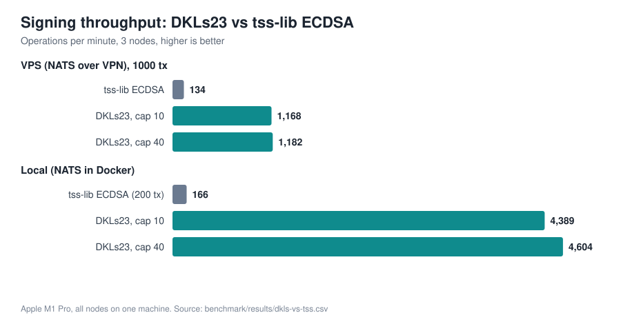

# DKLs23 vs tss-lib: signing benchmark



1000 signing requests, 3 nodes (t+1 = 3 signers), client batch size 8. DKLs23 is threshold ECDSA on secp256k1 only, so the comparison is against tss-lib **ECDSA**.

## Summary

| | VPS (NATS over VPN) | Local (NATS in Docker) |
|---|---|---|
| **DKLs23**, 1000 tx | **1,168–1,182 ops/min** (51 s) | **4,389–4,604 ops/min** (13 s) |
| **tss-lib ECDSA** | 134 ops/min (7 m 27 s, 1000 tx) | 167 ops/min (200 tx sample) |
| DKLs23 vs tss-lib | **~8.7x faster** | **~26x faster** |

- Every run finished at 100% success.
- tss-lib is bound by CPU (~170 ms of crypto per sign per node), so a faster network does not help it.
- DKLs23 is cheap on CPU (~17 ms per sign) and bound by the network and message size, so it gains the most from a fast link.

## Setup

- Machine: Apple M1 Pro (8 cores), macOS. The 3 nodes are local processes.
- VPS runs: NATS/JetStream and Consul on the VPS, reached over WireGuard (RTT about 10 ms for the final runs).
- Local runs: NATS and Consul in Docker on the same machine.
- `max_concurrent_signing` (JetStream `MaxAckPending`): 10 (default) and 40. DKLs23 barely changes between them because it is network-bound. tss-lib is measured at 10: its consumer is serial, so a larger cap only makes messages wait past the 30 s ack time and get redelivered (94% success at 40 in a test).
- Each run uses its own `--client-id`, so other consumers of the shared results consumer cannot take results.

## Results

Raw tool output for each row is in [`raw/`](./raw); the tidy table is [`dkls-vs-tss.csv`](./dkls-vs-tss.csv).

### VPS, 1000 tx

| Protocol | cap | Total | Ops/min | Avg latency (queued) | Success |
|---|---|---|---|---|---|
| DKLs23 | 10 | 51.4 s | 1,167.7 | 10.4 s | 100% |
| DKLs23 | 40 | 50.8 s | 1,181.8 | 9.7 s | 100% |
| tss-lib ECDSA | 10 | 447.4 s | 134.1 | 212.3 s | 100% |

Latency is measured from submission, so it includes queueing behind the batch; compare throughput, not latency.

### Local, NATS in Docker

| Protocol | tx | cap | Total | Ops/min | Success |
|---|---|---|---|---|---|
| DKLs23 | 1000 | 10 | 13.7 s | 4,388.6 | 100% |
| DKLs23 | 1000 | 40 | 13.0 s | 4,604.1 | 100% |
| tss-lib ECDSA | **200** | 10 | 72.1 s | 166.5 | 100% |

The local tss-lib number is a 200-tx sample. An earlier 1000-tx local run gave 173.9 ops/min.

## Why DKLs23 is faster

| Measurement | tss-lib ECDSA | DKLs23 |
|---|---|---|
| In-process sign (2-of-2, no network) | 172 ms | 16.7 ms (~10x) |
| Bytes on the wire per sign (3 nodes, both directions) | ~0.3 MB | ~1.05 MB (was ~3.7 MB before the wire changes) |

DKLs23 uses OT-extension multiplication: little CPU, many bytes (about 0.48 MB of protocol payload per sign across the 3 parties). The remaining wire cost is roughly that payload; broadcast fan-out and JSON/base64 were removed.

## How DKLs23 got here (VPS, 1000 tx)

| Step | Ops/min |
|---|---|
| Before optimizations | 196 |
| Concurrent signing wrapper + 20 ms barrier poll | 173–192 |
| Per-recipient delivery, binary framing, barrier-free router | 991 (cap 10), 1,095 (cap 40) |
| Final (refactored, key-info cache, typed results) | 1,168 (cap 10), 1,182 (cap 40) |

The network was not constant across these runs (ping to the VPS was about 95 ms for the early ones and about 10 ms for the final ones), so the ops/min steps are not a clean A/B. The robust result is the bytes per sign: 3.7 MB down to 1.05 MB.

## Reproduce

```bash
make dkls-lib                                   # needs the submodule and cargo
go build -tags dkls -o mpcium ./cmd/mpcium
go build -tags dkls -o mpcium-cli ./cmd/mpcium-cli

mpcium-cli benchmark --client-id run1 keygen-dkls 1      # prints "Wallet created: <id>"
mpcium-cli benchmark --client-id run1 --output out.txt sign-dkls23 1000 <dkls-wallet-id> --batch-size 8
mpcium-cli benchmark --client-id run2 --output out.txt sign-ecdsa  1000 <ecdsa-wallet-id> --batch-size 8

make bench-dkls        # in-process library benchmark (tss-lib vs DKLs23)
make bench-dkls-nats   # Session/Service benchmark over a Docker NATS
```

## Caveats

- One machine runs all three nodes plus the client, so CPU is shared and these are not production numbers.
- tss-lib cap sensitivity: see Setup.
- DKLs23 supports ECDSA/secp256k1 only. EdDSA stays on tss-lib.
- The in-process numbers are from 10 iterations on an M1 Pro.
